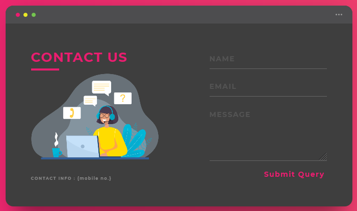
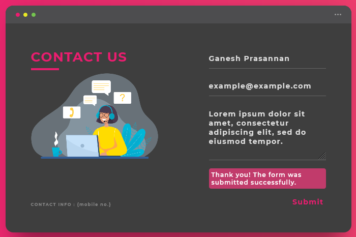
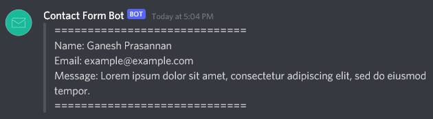
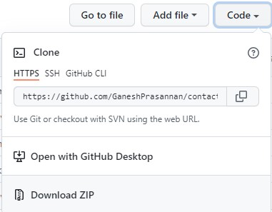
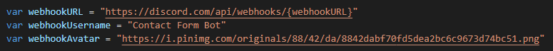

<h1>Contact Form Template</h1>
<h4>This is a fully functional Contact Form template which works using Discord Webhooks. Its really easy to customize and has a unique yet beautiful design.</h4> 

   

<h1>✨Examples</h1>
<h4>Here is an example of the Contact Form:-</h4>

   

<h1>✨Features</h1>
- Unique Frontend Design
- Customizable
- No Backend Required
- Uses Discord Webhooks services for the Contact Form
- Free & Open Source

  

<h1>⚡️ Installation</h1>
<h4>To download the code, click    and then click 'Download ZIP'</h4>   

<h1>💡 Customization</h1>
<h4>To customize the Discord Webhook, such as changing the `Webhook URL`, `Username`, or `Avatar`, go to `script.js`.</h4>
 

To set up the form, you have to set `webhookURL` value to the Discord Webhook URL in which you want the message to be recieved. This is <a href="https://help.dashe.io/en/articles/2521940-how-to-create-a-discord-webhook-url">How to get the link of a Discord Webhook</a>.

To change the Avatar/Profile of the discord webhook, copy the image link of the avatar of your choice and paste it as the value of the variable `webhookAvatar`, and for the Username, type out your desired username as the value of the variable `webhookUsername`.  

 
<h5>Made with ❤️ by Ganesh Prasannan</h5>
